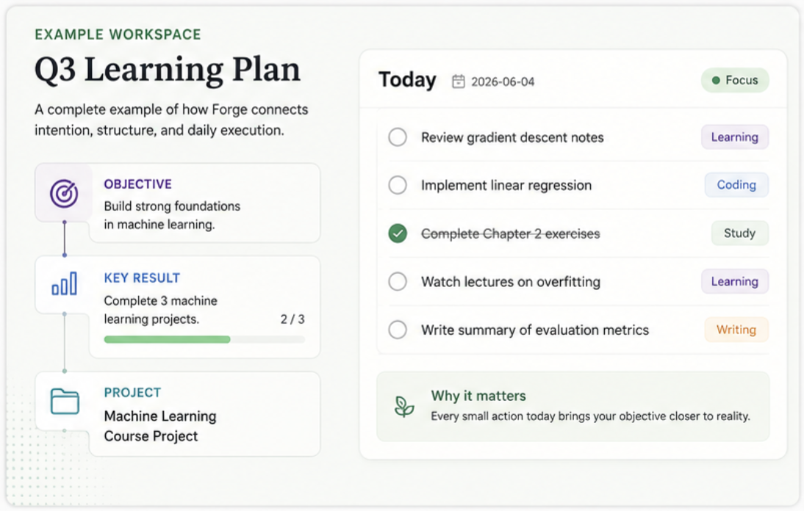
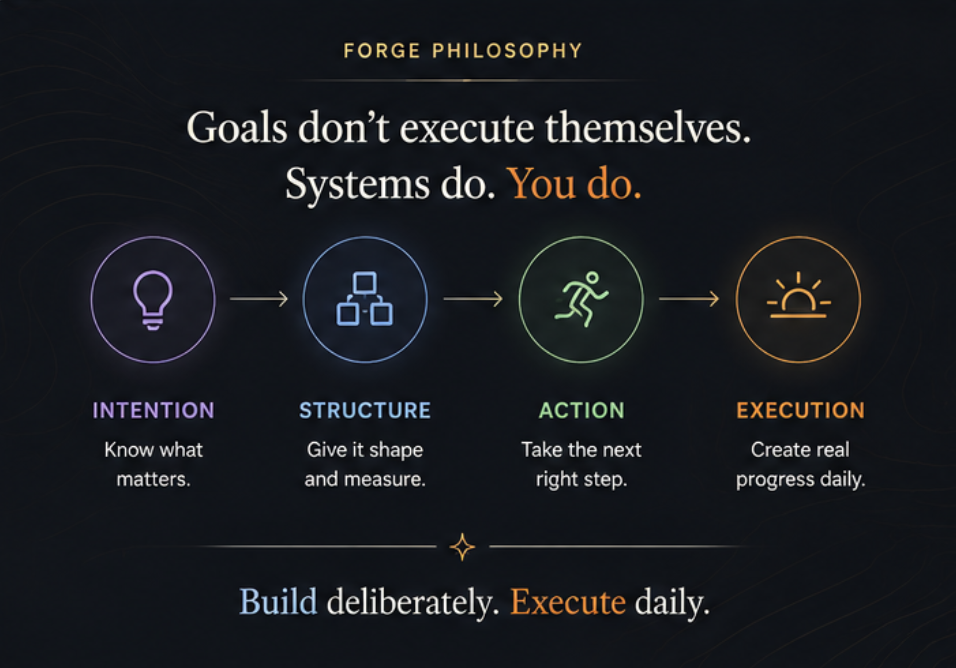
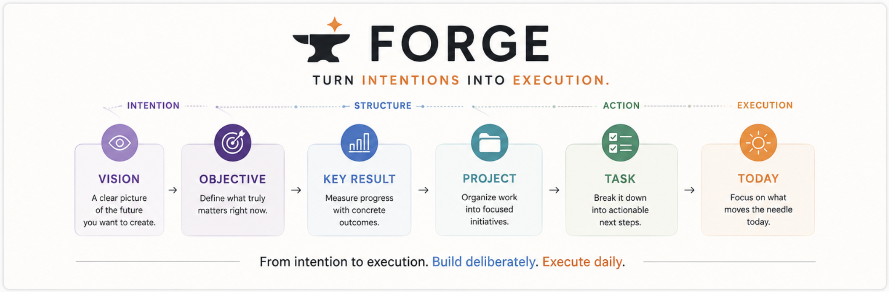

# Forge

**Forge · 铸行**

**Turn intentions into execution.**

把意图，铸成行动。

Forge is a focused personal execution system that helps turn goals into concrete daily action.

Forge 是一个专注的个人执行系统：把目标，变成今天真正发生的行动。

<p align="center">
  
</p>

[Download for Windows](https://github.com/sebastian-wong0412/Forge/releases/latest) · [Releases](https://github.com/sebastian-wong0412/Forge/releases) · [Source](https://github.com/sebastian-wong0412/Forge)

---

## What is Forge?

Forge gives long-term intent a structure you can act on.

You name where you want to go. You decide what to achieve in a season. You measure progress, organize the work, and schedule the next concrete step. Then Today shows only what belongs to this day.

Forge 把模糊的意图和长期目标，通过层层拆解，最终落成真实、持续的行动。

It is not another todo list. It is not a goal document that stays on the page. Forge is built for the distance between knowing what matters and actually doing it.

它不是又一个待办清单，也不是一份停在纸面上的目标表。Forge 关心的是中间那段距离：你知道什么重要，和你今天是否真的在做。

Data lives in SQLite on your machine. No account. No cloud. No second source of truth.

数据保存在本机 SQLite。没有账号，也没有云端副本。

---

## Product philosophy

Goals do not execute themselves. A system can hold the shape of an intention — and you still have to take the next step.

目标不会自己完成。系统可以托住意图的形状，但下一步仍然要你来走。

<p align="center">
  
</p>

Forge is organized around one conceptual chain:

**Vision → Objective → Key Result → Project → Task → Daily Execution**

| | English | 中文 |
|---|---|---|
| **Vision** | Where you want to go | 你想走向哪里 |
| **Objective** | What you want to achieve | 你想实现什么 |
| **Key Result** | How you measure progress | 如何衡量进展 |
| **Project** | How you move toward it | 如何推进它 |
| **Task** | What needs to be done | 具体需要做什么 |
| **Daily Execution** | What you do today | 今天真正做什么 |

**Vision** is a product idea: the longer direction above a season of work. It is not a page in this version.

**Vision** 是产品理念，是周期之上更长的方向。当前版本还没有独立页面。

In the app, **Cycle** is the planning root — a quarter, a launch window, a personal sprint. **Today** is daily execution. It is a projection of the tasks you scheduled, not a second list you maintain by hand.

当前产品以 **Cycle（周期）** 作为规划起点，以 **Today（今日）** 作为每天的执行面。

---

## How Forge turns intentions into execution

The hierarchy exists only so it can collapse back into a day.

结构存在，是为了能收回到这一天。

<p align="center">
  
</p>

The practical loop is:

**Intent → Outcome → Project → Task → Schedule → Today → Execute → Review / Progress**

- A **cycle** gives the work a season.
- An **objective** names the outcome that matters.
- A **key result** makes progress measurable. A **check-in** records where you are against that outcome. It is not a task.
- A **project** is the path of work.
- A **task** is something you can actually do.
- **Today** is where you decide what to do now — then start it, or mark it complete.

关键结果衡量进展；Check-in 记录进展。任务是真正去做的事。Today 决定今天做什么。

不要把 Check-in 当成任务完成，也不要把任务完成当成关键结果已经达成。

---

## What Forge already does

- First-run Welcome, with an optional **Example Workspace** so the hierarchy is easier to feel
- Plan work in time-bounded **cycles**, with objectives, projects, and tasks
- Track progress with **key results**: numeric, percentage, milestone, or written
- Record **append-only check-ins** — history is not edited away
- Start work and let the necessary parent cycle, objective, and project become active
- Open **Today** and see only what you scheduled for that date, with the project that owns each task
- Review a cycle when the season ends
- Use the desktop app in **Simplified Chinese** or **English**, or follow Windows
- Follow the Windows theme, or switch to dark
- Keep everything **local**: SQLite on this machine
- Install on **Windows x64** without Node, Rust, or a terminal
- Check GitHub Releases for a newer installer — Forge does not overwrite itself

---

## Getting started

### Windows

Download the latest installer from [Releases](https://github.com/sebastian-wong0412/Forge/releases/latest).

Install it, then open Forge from the Start Menu.

You do not need Node.js, Rust, Cargo, or a terminal. The local backend starts with the app. Data lives in `%LOCALAPPDATA%\app.forge.desktop`.

The installer is currently unsigned. Windows SmartScreen may show a warning.

macOS and Linux are not available.

### From source

For development only. Prerequisites: Rust stable, Node.js 22+, npm.

```bash
npm install
npm run tauri dev
```

That opens the desktop window and the local API. The backend can also run on its own:

```bash
cargo run -p forge-server
```

| Surface | Address |
|---|---|
| Desktop API | `http://127.0.0.1:17340` |
| Developer CLI API | `http://127.0.0.1:8080` |
| Vite | `http://localhost:1420` |

---

## Updates

Forge is in active iteration.

New Windows builds are published on [GitHub Releases](https://github.com/sebastian-wong0412/Forge/releases). In Settings, you can check for a newer version and download the installer. Forge will not replace the current install for you.

Release notes: [CHANGELOG](./CHANGELOG.md)

---

## Roadmap

Direction that is already in view:

- **Vision** — a longer-term layer above Cycle; not implemented yet
- Daily execution will continue to come from **tasks and Today**, not from expanding the frozen `DailyExecution` leftover

No other large roadmap is promised here.

---

## Development

Forge is a local-first desktop app:

```
React / TypeScript
        ↓
      Tauri 2
        ↓
   Rust HTTP API
        ↓
   Application
        ↓
     Domain
        ↓
     SQLite
```

The backend is authoritative. The desktop client is a view.

```bash
cargo fmt --all -- --check
cargo clippy --workspace --all-targets -- -D warnings
cargo test --workspace
npm test
npm run build
```

More detail: [docs/architecture.md](docs/architecture.md) · [docs/api.md](docs/api.md) · [docs/database.md](docs/database.md)

---

## License

[MIT](./LICENSE)
